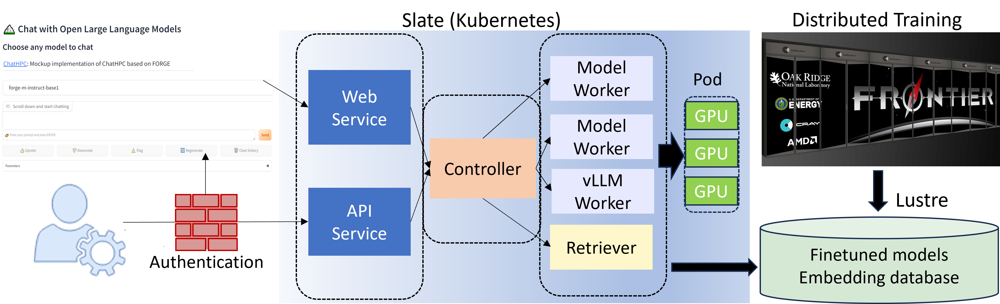

# chatHPC: Empowering HPC Users with Large Language Models 
This repository contains the implementation of chatHPC pipeline, including the end-to-end velopment and deployment cycle of LLM applications on HPC. 



## Data sources and preprocessing
HPC documentations and OLCF help tickets (contains private and sentitive information)
- OLCF: https://github.com/olcf/olcf-user-docs
- ALCF: https://github.com/argonne-lcf/user-guides
- NERSC: https://gitlab.com/NERSC/nersc.gitlab.io

The pre-processing scripts include for both [documents](./preprocess/process_olcf_doc.py) and [tickets](./preprocess/process_jira_tickets.py). 

## Continual pre-training 
The pre-training on HPC documents uses [FORGE](https://github.com/at-aaims/forge), and a sample input data is [provided](./data/train/model/olcf-user-doc-9-23.jsonl). The model configuration remains the same as the [Forge-13B](https://github.com/at-aaims/forge/blob/main/train/configs/forge-m.yml).

## SI^2 instruction set generation
The instruction set for fine-tuning is generated following SI^2 method, which is detailed [here](./si2/README.md). 

## Distributed fine-tuning
This step includes supervised fine-tuning (SFT), reward modeling, and reinforcement learning with human feedback (RLHF), which is detailed [here](./finetune/README.md) 

## RAG
Our setup includes following,  

- Generate the embedding database on the HPC documents with this [script](./rag/gen_emb_db.py)
- Test the retrieval QA with [LlamaCPP](./rag/test_rag.py) on Frontier
- RAG with Forge model on [Frontier](./rag/retrivalQA.py) and [FastChat](./interface/FastChat/fastchat/model/model_chathpc.py)

The prompt with retrieved documents as context follows,
```bash
Answer the question at the end. Use following input if the answer is related and be verbatim about links. Ignore the input if it is not related. 
Input:
{docs}

{prompt}
```

## User interface 
Both web and API interfaces to fine-tuned models are provided. The detailed steps are provided [here](./interface/README.md). 

## Evaluation 
We evaluate following component of the pipeline 

- [model](./eval/model/run.sh) performance
- [retriever](./eval/retriever/eval_embedder.py) accuracy
- [continuous learning](./eval/cl/run.sh)

The detailed steps are provided [here](./eval/README.md) 

## Results 
The plots of the results are generated using this [script](./plot.ipynb), and the corresponding raw job logs can be [downloaded](https://www.dropbox.com/scl/fo/xscwgb8o1d2c47kjwuap1/ABpnF0u4hE8i7JMMLy-7AgI?rlkey=p9fnhfyoqu8o7vh1jbgn6tnms&dl=0)
